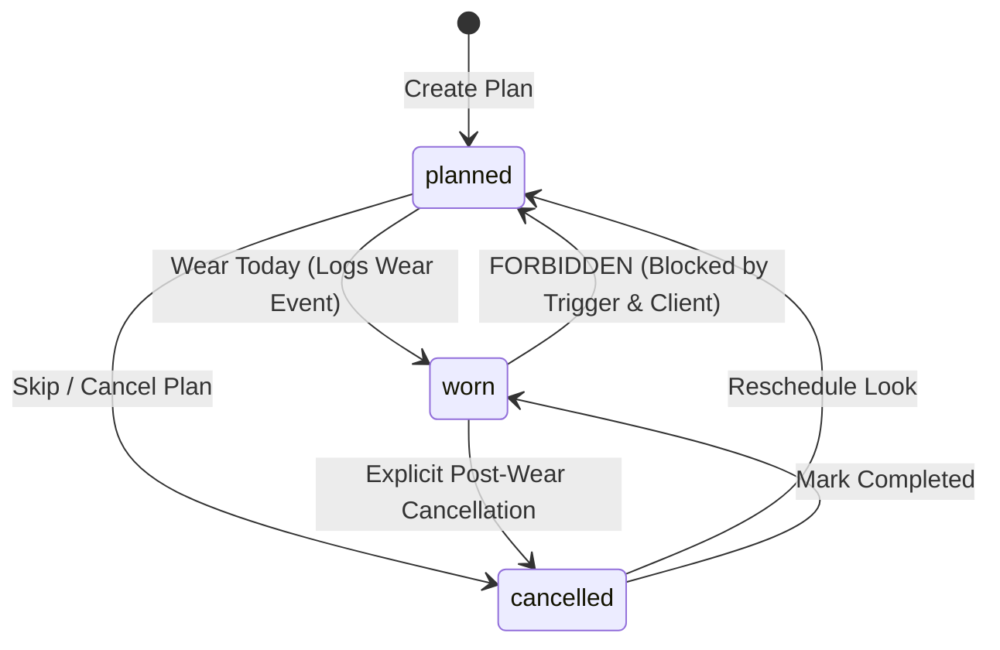
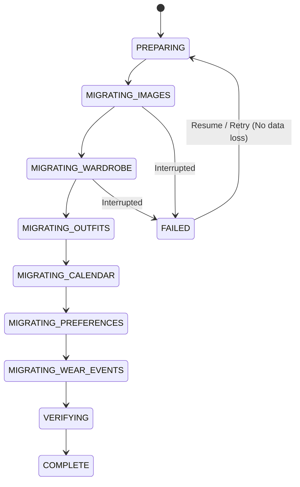

# StyleSaathi — Free / Open-Source Production Foundation V1 Architecture Specification
## Final Corrected Architecture Document

- **Date:** 2026-10-04
- **Status:** Architectural Correction Gate — Final Review Specification (DO NOT IMPLEMENT UNTIL APPROVED)
- **Architecture Approach:** Local-First + Persistent Typed Sync Queue + Eager UI + Supabase Cloud Foundation
- **Infrastructure:** React 19 + TypeScript + Vite + Supabase (Auth, PostgreSQL, Private Storage, RLS) + IndexedDB (Local-First Cache & Queue)
- **Target Cost:** ₹0 (Free tier only: zero paid AI APIs, zero custom Node/backend servers, zero Redis, zero CRDT/RxDB frameworks, zero unnecessary SaaS/realtime)

---

## 1. Executive Summary & Non-Negotiable Invariants

StyleSaathi is a digital wardrobe and personal styling platform engineered specifically for Indian wardrobes, garments, occasions, and styling habits (sarees, blouses, kurtas, dupattas, lehengas, Nehru jackets, Western wear, and Indo-Western fusions).

This architecture transitions StyleSaathi from a local-only application into a **multi-user production foundation** without altering existing styling logic or exceeding ₹0 infrastructure costs:

1. **₹0 Infrastructure Cost:** Uses only Supabase free-tier (Auth, PostgreSQL, Storage) with browser-side execution. No Redis, no custom Node backend, no paid AI/LLM APIs, no third-party sync platforms (no CRDT/RxDB/ElectricSQL).
2. **Local-First Boot & Zero-Latency UI:** App launches in 0ms from local IndexedDB and localStorage. Network latency never blocks UI rendering.
3. **Server-Authoritative Timestamp Security:** The client is never trusted to set authoritative server timestamps. `client_updated_at` tracks local mutation sequence for device-level ordering; `server_updated_at` is generated strictly by PostgreSQL database triggers via `clock_timestamp()`. Cloud delta queries exclusively consume `server_updated_at`.
4. **Strongly-Typed Sync Queue (Zero `payload: any`):** Every offline and online mutation is a discriminated union of `entityType` + `operation`, with typed payloads, client-generated stable `mutationId`, `createdAt`, `attemptCount`, `lastError`, `status`, and prerequisite `dependencies`.
5. **Enforced Calendar Cardinality & Monotonic State Machine:** The database enforces **one plan per user per date** (`UNIQUE(user_id, date)`). Calendar status follows a strict state machine (`planned`, `worn`, `cancelled`). An outfit plan marked `worn` **can never regress to `planned`**, enforced by PostgreSQL triggers and client reconciliation.
6. **Append-Only Idempotent Wear Tracking:** Wear events are modeled as an immutable append-only event stream using client-generated stable UUIDs (`event_id`). Event identity is never derived from `user + garment + date`. Two distinct wears produce two distinct event IDs. Sync retries reuse the same `event_id` with `ON CONFLICT (user_id, event_id) DO NOTHING` making delivery strictly idempotent. `timesWorn` and `lastWorn` are derived/cached fields.
7. **Atomic Wear Event Ownership:** Both PostgreSQL foreign keys and RLS `EXISTS` policies enforce that User A cannot create a wear event referencing User B's wardrobe item.
8. **Conservative Tombstones:** Fixed 30-day purge is removed. Tombstones (`is_deleted = true`, `deleted_at = now()`) are retained indefinitely in V1 to permanently prevent stale reconnecting devices from resurrecting deleted records. Correctness precedes storage savings.
9. **Authoritative Image Version Model & Safe 2-Phase Lifecycle:** Images transition through a verified lifecycle (`LOCAL -> COMPRESS -> QUEUE -> UPLOAD -> VERIFY -> ACTIVATE -> RETIRE OLD VERSION -> CLEANUP`). `storage_path` and `image_version_id` represent authoritative identity, not permanent public URLs. Upload or verification failures leave the previous active image reference intact.
10. **Storage Security & Folder Isolation:** Supabase Storage is private (`public = false`). RLS on `storage.objects` strictly enforces that User A cannot select, insert, update, delete, or generate signed access for objects outside `wardrobe/{auth.uid()}/...`.
11. **Granular Sync Retry & Error Classification:** Replaces blanket retry limits with error-aware classification (network/offline, transient cloud, session expiry, validation, authorization rejection, dependency wait, conflict). Transient failures remain retryable; permanent rejections isolate cleanly without discarding unrelated local mutations.
12. **Resumable & Idempotent Guest Migration:** Guest accounts can be elevated to authenticated cloud accounts without data loss or record duplication. Local data is never deleted during or after migration.
13. **Preserve Existing Product:** The existing Indian wardrobe taxonomy, deterministic recommendation engine, scoring heuristics, Smart Buy logic, Dress Me flow, and responsive design are 100% preserved.

---

## 2. PostgreSQL Relational Database Schema

All user-owned tables reside in `public` with Row Level Security enabled. Every table contains:
- `client_updated_at TIMESTAMPTZ NOT NULL`: Provided by client for local mutation ordering.
- `server_updated_at TIMESTAMPTZ NOT NULL DEFAULT now()`: Controlled exclusively by PostgreSQL triggers for cloud change feeds.

```sql
CREATE EXTENSION IF NOT EXISTS "uuid-ossp";

-- 1. PROFILES (1:1 with auth.users)
CREATE TABLE public.profiles (
  id UUID PRIMARY KEY REFERENCES auth.users(id) ON DELETE CASCADE,
  display_name TEXT NOT NULL DEFAULT 'StyleSaathi Member',
  created_at TIMESTAMPTZ NOT NULL DEFAULT now(),
  server_updated_at TIMESTAMPTZ NOT NULL DEFAULT now()
);

-- 2. WARDROBE ITEMS
CREATE TABLE public.wardrobe_items (
  id TEXT NOT NULL,
  user_id UUID NOT NULL REFERENCES auth.users(id) ON DELETE CASCADE,
  name TEXT NOT NULL,
  active_image_id TEXT,                    -- Stable image version ID
  storage_path TEXT,                       -- wardrobe/{user_id}/{item_id}/{image_version_id}.jpg
  photo_url TEXT,                          -- Cached signed URL / local blob URL (ephemeral)
  photo_id TEXT,                           -- Backward-compatibility alias for active_image_id
  category TEXT NOT NULL CHECK (category IN ('Tops', 'Bottoms', 'Ethnic', 'Dresses', 'Outerwear', 'Footwear', 'Accessories')),
  subcategory TEXT NOT NULL,
  colors TEXT[] NOT NULL DEFAULT '{}',
  seasons TEXT[] NOT NULL DEFAULT '{}',
  occasions TEXT[] NOT NULL DEFAULT '{}',
  formality SMALLINT NOT NULL CHECK (formality BETWEEN 1 AND 5),
  brand TEXT,
  status TEXT NOT NULL DEFAULT 'clean' CHECK (status IN ('clean', 'needs_washing', 'in_laundry')),
  favorite BOOLEAN NOT NULL DEFAULT false,
  note TEXT NOT NULL DEFAULT '',
  times_worn INT NOT NULL DEFAULT 0,       -- Optimized cache of wear events count
  last_worn TIMESTAMPTZ,                   -- Optimized cache of most recent wear event
  is_deleted BOOLEAN NOT NULL DEFAULT false,
  deleted_at TIMESTAMPTZ,
  client_updated_at TIMESTAMPTZ NOT NULL DEFAULT now(),
  created_at TIMESTAMPTZ NOT NULL DEFAULT now(),
  server_updated_at TIMESTAMPTZ NOT NULL DEFAULT now(),
  PRIMARY KEY (user_id, id)
);

-- 3. SAVED OUTFITS
CREATE TABLE public.saved_outfits (
  id TEXT NOT NULL,
  user_id UUID NOT NULL REFERENCES auth.users(id) ON DELETE CASCADE,
  name TEXT NOT NULL,
  outfit JSONB NOT NULL,
  saved_at BIGINT NOT NULL,
  is_deleted BOOLEAN NOT NULL DEFAULT false,
  deleted_at TIMESTAMPTZ,
  client_updated_at TIMESTAMPTZ NOT NULL DEFAULT now(),
  created_at TIMESTAMPTZ NOT NULL DEFAULT now(),
  server_updated_at TIMESTAMPTZ NOT NULL DEFAULT now(),
  PRIMARY KEY (user_id, id)
);

-- 4. CALENDAR PLANS (One plan per user per date enforced via UNIQUE constraint)
CREATE TABLE public.calendar_plans (
  id TEXT NOT NULL,
  user_id UUID NOT NULL REFERENCES auth.users(id) ON DELETE CASCADE,
  date DATE NOT NULL,
  occasion TEXT NOT NULL,
  status TEXT NOT NULL DEFAULT 'planned' CHECK (status IN ('planned', 'worn', 'cancelled')),
  outfit JSONB NOT NULL,
  accessory JSONB,
  is_deleted BOOLEAN NOT NULL DEFAULT false,
  deleted_at TIMESTAMPTZ,
  client_updated_at TIMESTAMPTZ NOT NULL DEFAULT now(),
  created_at TIMESTAMPTZ NOT NULL DEFAULT now(),
  server_updated_at TIMESTAMPTZ NOT NULL DEFAULT now(),
  PRIMARY KEY (user_id, id),
  CONSTRAINT uq_calendar_plans_user_date UNIQUE (user_id, date)
);

-- 5. STYLE PREFERENCES (1:1 with user)
CREATE TABLE public.style_preferences (
  user_id UUID PRIMARY KEY REFERENCES auth.users(id) ON DELETE CASCADE,
  preferred_contexts TEXT[] NOT NULL DEFAULT '{}',
  preferred_aesthetics TEXT[] NOT NULL DEFAULT '{}',
  styling_mode TEXT NOT NULL DEFAULT 'variety' CHECK (styling_mode IN ('simple', 'variety', 'experiment')),
  client_updated_at TIMESTAMPTZ NOT NULL DEFAULT now(),
  server_updated_at TIMESTAMPTZ NOT NULL DEFAULT now()
);

-- 6. WEAR EVENTS (Append-only wear history with atomic garment ownership foreign key)
CREATE TABLE public.wear_events (
  event_id TEXT NOT NULL,                 -- Client-generated UUIDv4 upon wear action
  user_id UUID NOT NULL REFERENCES auth.users(id) ON DELETE CASCADE,
  wardrobe_item_id TEXT NOT NULL,
  outfit_id TEXT,
  planned_date DATE,
  worn_at TIMESTAMPTZ NOT NULL DEFAULT now(),
  created_at TIMESTAMPTZ NOT NULL DEFAULT now(),
  PRIMARY KEY (user_id, event_id),
  CONSTRAINT fk_wear_events_wardrobe_item
    FOREIGN KEY (user_id, wardrobe_item_id)
    REFERENCES public.wardrobe_items(user_id, id)
    ON DELETE CASCADE
);
```

---

## 3. Database Triggers & Server Functions

### 3.1 Server-Authoritative Timestamp Trigger
Untrusted clients cannot dictate `server_updated_at`. Every `INSERT` or `UPDATE` overrides `server_updated_at` with PostgreSQL `clock_timestamp()`:

```sql
CREATE OR REPLACE FUNCTION public.set_server_updated_at()
RETURNS TRIGGER AS $$
BEGIN
  NEW.server_updated_at := clock_timestamp();
  RETURN NEW;
END;
$$ LANGUAGE plpgsql;

CREATE TRIGGER trg_wardrobe_items_server_timestamp
  BEFORE INSERT OR UPDATE ON public.wardrobe_items
  FOR EACH ROW EXECUTE FUNCTION public.set_server_updated_at();

CREATE TRIGGER trg_saved_outfits_server_timestamp
  BEFORE INSERT OR UPDATE ON public.saved_outfits
  FOR EACH ROW EXECUTE FUNCTION public.set_server_updated_at();

CREATE TRIGGER trg_calendar_plans_server_timestamp
  BEFORE INSERT OR UPDATE ON public.calendar_plans
  FOR EACH ROW EXECUTE FUNCTION public.set_server_updated_at();

CREATE TRIGGER trg_style_preferences_server_timestamp
  BEFORE INSERT OR UPDATE ON public.style_preferences
  FOR EACH ROW EXECUTE FUNCTION public.set_server_updated_at();
```

### 3.2 Monotonic Calendar Plan Status Trigger
Enforces at the database tier that a calendar plan in state `worn` can never regress to `planned`:

```sql
CREATE OR REPLACE FUNCTION public.guard_calendar_plan_status()
RETURNS TRIGGER AS $$
BEGIN
  IF OLD.status = 'worn' AND NEW.status = 'planned' THEN
    RAISE EXCEPTION 'Monotonic invariant violation: A plan marked WORN cannot revert to PLANNED (plan: %, date: %)', OLD.id, OLD.date;
  END IF;
  RETURN NEW;
END;
$$ LANGUAGE plpgsql;

CREATE TRIGGER trg_guard_calendar_plan_status
  BEFORE UPDATE ON public.calendar_plans
  FOR EACH ROW EXECUTE FUNCTION public.guard_calendar_plan_status();
```

### 3.3 New User Profile Provisioning Trigger
```sql
CREATE OR REPLACE FUNCTION public.handle_new_user()
RETURNS TRIGGER AS $$
BEGIN
  INSERT INTO public.profiles (id, display_name)
  VALUES (
    new.id,
    COALESCE(new.raw_user_meta_data->>'name', split_part(new.email, '@', 1), 'StyleSaathi Member')
  )
  ON CONFLICT (id) DO NOTHING;
  RETURN NEW;
END;
$$ LANGUAGE plpgsql SECURITY DEFINER;

CREATE TRIGGER on_auth_user_created
  AFTER INSERT ON auth.users
  FOR EACH ROW EXECUTE FUNCTION public.handle_new_user();
```

---

## 4. PostgreSQL Row Level Security (RLS) Policies

All tables enable RLS. Client-provided `user_id` is never trusted; `auth.uid()` is authoritative:

```sql
ALTER TABLE public.profiles ENABLE ROW LEVEL SECURITY;
ALTER TABLE public.wardrobe_items ENABLE ROW LEVEL SECURITY;
ALTER TABLE public.saved_outfits ENABLE ROW LEVEL SECURITY;
ALTER TABLE public.calendar_plans ENABLE ROW LEVEL SECURITY;
ALTER TABLE public.style_preferences ENABLE ROW LEVEL SECURITY;
ALTER TABLE public.wear_events ENABLE ROW LEVEL SECURITY;

-- 1. Profiles
CREATE POLICY "profiles_select_own" ON public.profiles FOR SELECT USING (auth.uid() = id);
CREATE POLICY "profiles_insert_own" ON public.profiles FOR INSERT WITH CHECK (auth.uid() = id);
CREATE POLICY "profiles_update_own" ON public.profiles FOR UPDATE USING (auth.uid() = id) WITH CHECK (auth.uid() = id);
CREATE POLICY "profiles_delete_own" ON public.profiles FOR DELETE USING (auth.uid() = id);

-- 2. Wardrobe Items
CREATE POLICY "wardrobe_items_select_own" ON public.wardrobe_items FOR SELECT USING (auth.uid() = user_id);
CREATE POLICY "wardrobe_items_insert_own" ON public.wardrobe_items FOR INSERT WITH CHECK (auth.uid() = user_id);
CREATE POLICY "wardrobe_items_update_own" ON public.wardrobe_items FOR UPDATE USING (auth.uid() = user_id) WITH CHECK (auth.uid() = user_id);
CREATE POLICY "wardrobe_items_delete_own" ON public.wardrobe_items FOR DELETE USING (auth.uid() = user_id);

-- 3. Saved Outfits
CREATE POLICY "saved_outfits_select_own" ON public.saved_outfits FOR SELECT USING (auth.uid() = user_id);
CREATE POLICY "saved_outfits_insert_own" ON public.saved_outfits FOR INSERT WITH CHECK (auth.uid() = user_id);
CREATE POLICY "saved_outfits_update_own" ON public.saved_outfits FOR UPDATE USING (auth.uid() = user_id) WITH CHECK (auth.uid() = user_id);
CREATE POLICY "saved_outfits_delete_own" ON public.saved_outfits FOR DELETE USING (auth.uid() = user_id);

-- 4. Calendar Plans
CREATE POLICY "calendar_plans_select_own" ON public.calendar_plans FOR SELECT USING (auth.uid() = user_id);
CREATE POLICY "calendar_plans_insert_own" ON public.calendar_plans FOR INSERT WITH CHECK (auth.uid() = user_id);
CREATE POLICY "calendar_plans_update_own" ON public.calendar_plans FOR UPDATE USING (auth.uid() = user_id) WITH CHECK (auth.uid() = user_id);
CREATE POLICY "calendar_plans_delete_own" ON public.calendar_plans FOR DELETE USING (auth.uid() = user_id);

-- 5. Style Preferences
CREATE POLICY "style_preferences_select_own" ON public.style_preferences FOR SELECT USING (auth.uid() = user_id);
CREATE POLICY "style_preferences_insert_own" ON public.style_preferences FOR INSERT WITH CHECK (auth.uid() = user_id);
CREATE POLICY "style_preferences_update_own" ON public.style_preferences FOR UPDATE USING (auth.uid() = user_id) WITH CHECK (auth.uid() = user_id);
CREATE POLICY "style_preferences_delete_own" ON public.style_preferences FOR DELETE USING (auth.uid() = user_id);

-- 6. Wear Events (Enforces auth.uid() = user_id AND garment ownership in wardrobe_items)
CREATE POLICY "wear_events_select_own" ON public.wear_events FOR SELECT USING (auth.uid() = user_id);
CREATE POLICY "wear_events_insert_own" ON public.wear_events FOR INSERT WITH CHECK (
  auth.uid() = user_id AND
  EXISTS (
    SELECT 1 FROM public.wardrobe_items
    WHERE id = wear_events.wardrobe_item_id AND user_id = auth.uid()
  )
);
CREATE POLICY "wear_events_update_own" ON public.wear_events FOR UPDATE USING (auth.uid() = user_id) WITH CHECK (auth.uid() = user_id);
CREATE POLICY "wear_events_delete_own" ON public.wear_events FOR DELETE USING (auth.uid() = user_id);
```

---

## 5. Supabase Storage Architecture & Security Model

- **Bucket Name:** `wardrobe` (Private: `public = false`).
- **File Limit:** 5 MB max per file (canvas compresses in-browser to ~65 KB; 5 MB protects edge cases).
- **Storage Namespace Hierarchy:**
  `wardrobe/{user_id}/{item_id}/{image_version_id}.jpg`
- **Path Verification Rule:** `(storage.foldername(name))[1] = auth.uid()::text`. User A cannot read, upload, overwrite, delete, or generate signed access for objects under User B's folder.

```sql
INSERT INTO storage.buckets (id, name, public, file_size_limit, allowed_mime_types)
VALUES (
  'wardrobe', 
  'wardrobe', 
  false, 
  5242880, 
  ARRAY['image/jpeg', 'image/webp', 'image/png']
)
ON CONFLICT (id) DO UPDATE SET
  public = false,
  file_size_limit = 5242880,
  allowed_mime_types = ARRAY['image/jpeg', 'image/webp', 'image/png'];

CREATE POLICY "wardrobe_storage_select" ON storage.objects
  FOR SELECT TO authenticated
  USING (bucket_id = 'wardrobe' AND (storage.foldername(name))[1] = auth.uid()::text);

CREATE POLICY "wardrobe_storage_insert" ON storage.objects
  FOR INSERT TO authenticated
  WITH CHECK (bucket_id = 'wardrobe' AND (storage.foldername(name))[1] = auth.uid()::text);

CREATE POLICY "wardrobe_storage_update" ON storage.objects
  FOR UPDATE TO authenticated
  USING (bucket_id = 'wardrobe' AND (storage.foldername(name))[1] = auth.uid()::text);

CREATE POLICY "wardrobe_storage_delete" ON storage.objects
  FOR DELETE TO authenticated
  USING (bucket_id = 'wardrobe' AND (storage.foldername(name))[1] = auth.uid()::text);
```

### 5.1 Safe 2-Phase Image Lifecycle & Version Model

Authoritative image identity is governed by:
`wardrobe item` $\rightarrow$ `image version` $\rightarrow$ `storage object` $\rightarrow$ `verification state` $\rightarrow$ `active image reference`

```
LOCAL IMAGE
    ↓ (Compress to max 800px / JPEG 0.8)
STORE LOCALLY (IndexedDB imageStore)
    ↓
QUEUE UPLOAD MUTATION
    ↓
UPLOAD TO SUPABASE (wardrobe/{user_id}/{item_id}/{image_version_id}.jpg)
    ↓
VERIFY STORAGE OBJECT (Signed GET/HEAD probe)
    ↓
ACTIVATE NEW VERSION (Update active_image_id and storage_path on item)
    ↓
RETIRE OLD VERSION (Queue DELETE_IMAGE for previous image_version_id)
    ↓
CLEANUP
```

#### Failure Invariants:
1. **If upload fails:** Previous active image reference on `wardrobe_item` is unchanged. UI continues displaying local cache.
2. **If verification fails:** Previous active image reference is retained; mutation retries or stays pending.
3. **If activation fails:** Storage object exists safely, but item reference is unchanged. Safe to retry.
4. **If cleanup fails:** Storage garbage does not break the active image. Non-blocking error logged for periodic background cleanup.

---

## 6. Strongly-Typed Sync Queue Mutation Model (No `payload: any`)

The sync queue is persisted in IndexedDB (`stylesaathi-sync-queue-db`, store `mutations`). Every mutation has an exact type derived from the discriminated union of `entityType` and `operation`.

```ts
export type MutationStatus = 'pending' | 'in_flight' | 'failed' | 'dead_letter';

export interface BaseSyncMutation {
  mutationId: string;       // Stable client-generated UUID
  createdAt: number;        // Epoch millis when user initiated mutation
  attemptCount: number;     // Number of processing attempts
  maxAttempts: number;      // Maximum retries before dead-lettering (transient only)
  nextRetryAt: number;      // Epoch millis for exponential backoff scheduling
  lastError: string | null; // Last captured error message
  status: MutationStatus;   // Queue lifecycle status
  dependencies?: string[];  // Prerequisite mutation IDs that must complete first
}

// 1. Wardrobe Item Upsert
export interface WardrobeItemUpsertMutation extends BaseSyncMutation {
  entityType: 'wardrobe_item';
  entityId: string;
  operation: 'UPSERT';
  payload: WardrobeItem;
}

// 2. Wardrobe Item Delete / Tombstone
export interface WardrobeItemDeleteMutation extends BaseSyncMutation {
  entityType: 'wardrobe_item';
  entityId: string;
  operation: 'DELETE';
  payload: {
    id: string;
    deletedAt: number;
  };
}

// 3. Calendar Plan Upsert
export interface CalendarPlanUpsertMutation extends BaseSyncMutation {
  entityType: 'calendar_plan';
  entityId: string;
  operation: 'UPSERT';
  payload: OutfitPlan;
}

// 4. Calendar Plan Delete
export interface CalendarPlanDeleteMutation extends BaseSyncMutation {
  entityType: 'calendar_plan';
  entityId: string;
  operation: 'DELETE';
  payload: {
    id: string;
    date: string;
    deletedAt: number;
  };
}

// 5. Style Preferences Update
export interface StylePreferencesUpdateMutation extends BaseSyncMutation {
  entityType: 'style_preferences';
  entityId: string;
  operation: 'UPDATE';
  payload: StylePreferences;
}

// 6. Saved Outfit Upsert
export interface SavedOutfitUpsertMutation extends BaseSyncMutation {
  entityType: 'saved_outfit';
  entityId: string;
  operation: 'UPSERT';
  payload: SavedOutfit;
}

// 7. Saved Outfit Delete
export interface SavedOutfitDeleteMutation extends BaseSyncMutation {
  entityType: 'saved_outfit';
  entityId: string;
  operation: 'DELETE';
  payload: {
    id: string;
    deletedAt: number;
  };
}

// 8. Wear Event Append
export interface WearEventAppendMutation extends BaseSyncMutation {
  entityType: 'wear_event';
  entityId: string; // Stable event UUID
  operation: 'APPEND_WEAR';
  payload: {
    eventId: string;
    wardrobeItemId: string;
    outfitId?: string;
    plannedDate?: string;
    wornAt: string;
  };
}

// 9. Image Upload
export interface ImageUploadMutation extends BaseSyncMutation {
  entityType: 'wardrobe_image';
  entityId: string; // imageVersionId
  operation: 'UPLOAD_IMAGE';
  payload: {
    itemId: string;
    imageVersionId: string;
    storagePath: string;
  };
}

// 10. Image Activation
export interface ImageActivationMutation extends BaseSyncMutation {
  entityType: 'wardrobe_image';
  entityId: string; // imageVersionId
  operation: 'ACTIVATE_IMAGE';
  payload: {
    itemId: string;
    imageVersionId: string;
    storagePath: string;
    previousImageVersionId?: string;
  };
}

// 11. Image Retirement / Cleanup
export interface ImageRetirementMutation extends BaseSyncMutation {
  entityType: 'wardrobe_image';
  entityId: string; // imageVersionId
  operation: 'DELETE_IMAGE';
  payload: {
    itemId: string;
    imageVersionId: string;
    storagePath: string;
  };
}

export type SyncMutation =
  | WardrobeItemUpsertMutation
  | WardrobeItemDeleteMutation
  | CalendarPlanUpsertMutation
  | CalendarPlanDeleteMutation
  | StylePreferencesUpdateMutation
  | SavedOutfitUpsertMutation
  | SavedOutfitDeleteMutation
  | WearEventAppendMutation
  | ImageUploadMutation
  | ImageActivationMutation
  | ImageRetirementMutation;
```

---

## 7. Data-Specific Conflict Resolution Semantics

Blanket Last-Write-Wins (LWW) is strictly avoided. Each entity type implements dedicated deterministic reconciliation:

| Entity Category | Reconciliation Strategy | Invariants & Rules |
| :--- | :--- | :--- |
| **Wardrobe Items** | Tombstone Priority + Timestamp Ordering | If either record is a tombstone (`is_deleted = true`), the tombstone wins permanently. Otherwise, compares local `client_updated_at` against remote `server_updated_at`. |
| **Style Preferences** | Deterministic Timestamp LWW | Highest timestamp wins. Profile preferences are a single document representing current lifestyle. |
| **Calendar Plans** | Monotonic Status Lifecycle + Date Identity | Unique by `(user_id, date)`. `planned` can transition to `worn` or `cancelled`. **`worn` can never revert to `planned`**. Deletions take precedence. |
| **Wear History** | Append-Only Idempotent Log | Immutable wear events with client UUIDs. Delivery retry with same ID is a no-op (`ON CONFLICT (user_id, event_id) DO NOTHING`). `timesWorn` is calculated from the event stream. |
| **Saved Outfits** | Tombstone Priority + Timestamp Ordering | Tombstones prevent resurrection. Newest valid edit timestamp wins. |
| **Garment Images** | 2-Phase Swap & Verification | New image version verified before updating garment reference; previous version safely retired. |

---

## 8. Calendar State Machine & Monotonic Invariant

Calendar plans model a single look per date. Allowed states: `planned`, `worn`, `cancelled`.



### Transition Specifications:

1. **`planned -> worn` (ALLOWED):** User confirms wearing the look. Dispatches `WearEventAppendMutation` for all items in outfit and transitions plan status to `worn`.
2. **`planned -> cancelled` (ALLOWED):** User skips the look or cancels the occasion. Plan status transitions to `cancelled`. No wear events logged.
3. **`worn -> planned` (FORBIDDEN):** Invariant violation. Once marked `worn`, an outfit cannot be reverted to un-worn / planned. Database trigger `trg_guard_calendar_plan_status` rejects with exception; client conflict resolver silences stale remote plans.
4. **`worn -> cancelled` (EXPLICITLY DEFINED - ALLOWED):** User retrospectively cancels a worn plan (e.g., event aborted after dressing). Plan transitions to `cancelled`. Existing wear events remain in history or are audited, but the plan does not regress to `planned`.
5. **`cancelled -> planned` (EXPLICITLY DEFINED - ALLOWED):** User reschedules an occasion on that date. Transitions to `planned`.
6. **`cancelled -> worn` (EXPLICITLY DEFINED - ALLOWED):** User wore the look despite previously cancelling. Transitions to `worn` and logs wear events.

---

## 9. Append-Only Wear Events & Ownership Integrity

1. **Client-Generated UUID (`event_id`):** Whenever the user wears a look or an individual item, the client generates a stable UUIDv4.
2. **Never Derive Identity Solely from Attributes:** Event identity is NOT derived from `user + garment + date + timestamp`. Two distinct wear actions on the same day generate two distinct UUIDs and produce two distinct wear events.
3. **Idempotency on Retry:** If a network failure interrupts sync, retrying the mutation reuses the exact same UUID. The database command:
   ```sql
   INSERT INTO public.wear_events (event_id, user_id, wardrobe_item_id, outfit_id, planned_date, worn_at)
   VALUES (...)
   ON CONFLICT (user_id, event_id) DO NOTHING;
   ```
   guarantees that retry never double-counts a wear.
4. **Atomic Ownership Enforcement:** The composite foreign key `(user_id, wardrobe_item_id) REFERENCES public.wardrobe_items(user_id, id)` and RLS policy prevent User A from recording a wear event referencing User B's wardrobe item.

---

## 10. Conservative Tombstone Strategy

1. **No Arbitrary 30-Day Purge:** The fixed 30-day purge is permanently removed. V1 retains tombstones conservatively.
2. **Zombie Resurrection Prevention:** When an offline device reconnects months later with an older version of an item, the local or remote tombstone (`is_deleted = true`) wins deterministically over any active state.
3. **Soft Deletion Payload:** Deletions record `is_deleted = true`, `deleted_at = now()`, and `client_updated_at = now()`.
4. **Storage Economics:** Soft deletion rows in PostgreSQL consume minimal storage (~100 bytes) and protect user data integrity.

---

## 11. Resumable Guest-to-Account Migration Architecture

When a guest user signs in via Google OAuth or Email OTP:



1. **State Persistence:** Migration progress is persisted in `localStorage` under `stylesaathi-migration-{userId}`:
   ```ts
   interface MigrationState {
     status: 'NOT_STARTED' | 'PREPARING' | 'MIGRATING_IMAGES' | 'MIGRATING_WARDROBE' | 'MIGRATING_OUTFITS' | 'MIGRATING_CALENDAR' | 'MIGRATING_PREFERENCES' | 'MIGRATING_WEAR_EVENTS' | 'VERIFYING' | 'COMPLETE' | 'FAILED';
     completedSteps: string[];
     lastError: string | null;
     updatedAt: number;
   }
   ```
2. **Never Wipe Local Data:** Local data is never deleted during or after migration.
3. **Idempotent Step Execution:**
   - Step 1: Upload guest image blobs from IndexedDB to `wardrobe/{userId}/{itemId}/{imageVersionId}.jpg`.
   - Step 2: Upsert wardrobe items with `user_id = user.id`.
   - Step 3: Upsert saved outfits with `user_id = user.id`.
   - Step 4: Upsert calendar plans with `user_id = user.id`.
   - Step 5: Upsert style preferences with `user_id = user.id`.
   - Step 6: Upsert wear events with `user_id = user.id`.
   - Step 7: Update local items with `userId = user.id`.
   - Step 8: Mark status `COMPLETE`.
4. **Interruption Recovery:** If interrupted midway, subsequent runs inspect `completedSteps` and resume without duplicating items or re-uploading images.

---

## 12. Network Failure & Error Classification Model

Errors are categorized into actionable paths:

| Error Category | Identification / Codes | Retry Strategy | Dead-Letter / Action | UX Feedback |
| :--- | :--- | :--- | :--- | :--- |
| **Offline / Network** | `TypeError: Failed to fetch`, `navigator.onLine === false` | Pause queue; 0 attempt penalty; automatic resume upon `window.online`. | Never dead-letters. | *"Saved on this device · Syncing when you're back online"* |
| **Transient Cloud** | HTTP 500, 502, 503, 504, 429 rate limit | Exponential backoff ($1\text{s} \times 2^{\text{attempt}} + \text{jitter}$, max 60s). Up to 5 retries. | Dead-letters after max retries; retains local data. | *"Syncing changes with cloud..."* |
| **Auth / Session** | HTTP 401, expired JWT, invalid refresh token | Pause queue; trigger silent token refresh. If refresh fails, prompt re-login. | Never discard mutations. Resume queue on sign-in. | *"Session expired · Please sign in to resume cloud sync"* |
| **Validation Failure** | Payload format mismatch, invalid enum | Immediate dead-letter. | Do NOT block unrelated queue items. Alert diagnostic log. | *"Item formatting issue prevented cloud sync"* |
| **RLS Authorization** | HTTP 403, PostgreSQL `42501` | Immediate dead-letter. | Quarantine mutation; local item remains visible locally. | *"Sync permission error on this item"* |
| **Constraint Rejection** | Foreign key violation `23503`, check violation | Immediate dead-letter. | Log violation; retain local state. | *"Sync conflict: dependent record not found"* |
| **Dependency Wait** | Prerequisite mutation pending (e.g. image upload) | Hold mutation in `pending`. | Wait until dependency completes; proceed sequentially. | *"Uploading photo before saving item..."* |

---

## 13. Authentication Architecture & Flows

### 13.1 Google OAuth Flow
1. User clicks "Continue with Google".
2. Calls `supabase.auth.signInWithOAuth({ provider: 'google', options: { redirectTo: window.location.origin } })`.
3. Redirects to Google consent screen and returns to StyleSaathi origin with authorization tokens.
4. Supabase client restores session, fires `SIGNED_IN` event.
5. AuthContext initiates resumable **Guest $\rightarrow$ Account Migration**.

### 13.2 Email OTP Passwordless Flow
1. User enters email (and optional name).
2. Taps "Send Login Code".
3. `signInWithOtp({ email, options: { shouldCreateUser: true } })` sends 6-digit verification code.
4. UI transitions to 6-digit OTP input with resend countdown.
5. User enters code $\rightarrow$ `verifyOtp({ email, token, type: 'email' })`.
6. Validated session initiates resumable **Guest $\rightarrow$ Account Migration**.

### 13.3 Guest Mode
1. User clicks "Continue without an account".
2. Local guest session created with `isGuest: true`.
3. 100% of StyleSaathi features (Wardrobe, Outfit Engine, Smart Buy, Calendar, Wear Tracking) remain fully operational locally.

---

## 14. Security Audit & Cross-User Test Verification Matrix

| Test ID | Test Scenario | Mechanism Under Test | Expected Result |
| :--- | :--- | :--- | :--- |
| **SEC-01** | User A queries `wardrobe_items` of User B | `wardrobe_items_select_own` RLS | Query returns 0 rows. |
| **SEC-02** | User A executes `UPDATE` on User B's wardrobe item | `wardrobe_items_update_own` RLS | 0 rows affected or throws `42501`. |
| **SEC-03** | User A executes `DELETE` on User B's wardrobe item | `wardrobe_items_delete_own` RLS | 0 rows affected. |
| **SEC-04** | User A inserts wear event referencing User B's item | `wear_events_insert_own` RLS + Foreign Key | Blocked with permission or foreign key error. |
| **SEC-05** | User A downloads or reads User B's Storage object | `wardrobe_storage_select` RLS | Access Denied / 403 / 0 rows. |
| **SEC-06** | User A generates signed URL for User B's object | Storage path check `(storage.foldername(name))[1]` | Storage RLS rejects token creation. |
| **SEC-07** | Zero Secret Exposure Audit | Static grep across repository & `.env.example` | Zero `service_role` keys or private API secrets present. |

---

## 15. Exact Implementation Files & Architecture Seams

```
src/
├── lib/
│   ├── supabase.ts                     # Supabase client, configuration check, safe env loading
│   └── sync/
│       ├── syncQueue.ts                # IndexedDB persistent typed mutation queue
│       ├── syncService.ts              # Sync engine, remote execution, guest migration
│       └── conflictResolvers.ts        # Pure deterministic conflict resolution functions
├── hooks/
│   └── useSyncStatus.ts                # Hook exposing network & queue status for editorial UI
├── repositories/
│   ├── WardrobeRepository.ts           # Extended interface with raw sync methods
│   ├── LocalStorageWardrobeRepository.ts # Hardened local wardrobe repo with tombstones
│   ├── LocalStorageCalendarRepository.ts # Hardened calendar repo with monotonic status
│   ├── LocalStoragePreferencesRepository.ts # Hardened preferences repo
│   ├── LocalStorageWearEventsRepository.ts # Dedicated append-only wear event repo
│   ├── SupabaseAuthRepository.ts       # Supabase Auth, Google OAuth, Email OTP, guest sessions
│   └── LocalStorageAuthRepository.ts   # Local fallback repo for unconfigured environments
├── context/
│   ├── AuthContext.tsx                 # Supabase session lifecycle & guest migration trigger
│   └── WardrobeContext.tsx             # Mutation queue integration for all user actions
├── components/
│   └── auth/
│       └── AuthView.tsx                # Google OAuth button + 2-step Email OTP interface
└── screens/
    └── ProfileScreen.tsx               # Sync status badge ("Saved on this device...") + controls

supabase/
├── schema.sql                          # Complete PostgreSQL schema, constraints, triggers, RLS
└── storage.sql                         # Private wardrobe storage bucket & RLS policies

src/__tests__/
├── conflictResolvers.test.ts           # Deterministic reconciliation tests
├── syncQueue.test.ts                   # FIFO, dependencies, retries, dead-lettering
├── wearEvents.test.ts                  # Idempotency, non-derived UUIDs, ownership
├── guestMigration.test.ts              # Resumability, zero-data-loss, step checkpointing
├── imageSyncAndStorage.test.ts         # 2-phase lifecycle, versioning, failure recovery
├── securityAndRLS.test.ts              # SEC-01 through SEC-07 cross-user tests
└── authAndSession.test.ts              # Google OAuth, Email OTP, Guest mode
```

---

## 16. Verification & Implementation Gate Checklist

Implementation will begin ONLY after this architecture is formally approved:
- [x] Strongly-typed sync mutations (zero `payload: any`, 11 discrete typed operations).
- [x] Server-authoritative timestamps via PostgreSQL trigger `set_server_updated_at()`.
- [x] Append-only wear events with client UUIDs (`event_id`) and composite primary key `(user_id, event_id)`.
- [x] Atomic wear event garment ownership via foreign key + RLS `EXISTS` check.
- [x] Calendar uniqueness constraint `UNIQUE(user_id, date)`.
- [x] Monotonic calendar plan status trigger preventing `worn -> planned`.
- [x] Conservative tombstones (30-day purge removed).
- [x] Image versioning and safe 2-phase swap lifecycle.
- [x] Private Supabase Storage with folder-scoped RLS policies.
- [x] 7-tier granular error classification and retry strategy.
- [x] Resumable guest migration state machine with zero local data loss.
- [x] Security test matrix SEC-01 through SEC-07.
- [x] Preservation of existing Indian taxonomy, outfit engine, and UI.
- [x] Strict adherence to ₹0 free tier.
